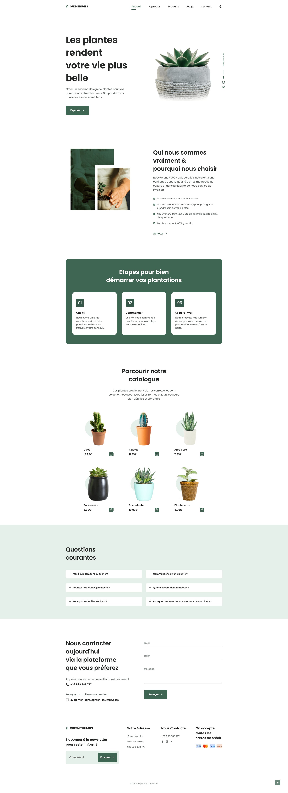

# 🌿 Green Thumbs

Welcome to **Green Thumbs**, a web application developed in an academic context!
This showcase website offers a modern green universe, a smooth user experience, and clear features to help you discover, choose, and order your favorite plants.

---

## 🚀 Preview



---

## 🛠️ Tech Stack

- **HTML5**
- **CSS3** (with `normalize.css`)
- **JavaScript**
- **Fontawesome** for icons
- **Responsive Design** 🌐

---

## 📂 Project structure

```
📁 assets/
├── 📁 css/
│   ├── normalize.css
│   └── style.css
├── 📁 img/
│   └── (plant images, cards, etc.)
├── 📁 js/
│   └── app.js
📄 index.html
📄 README.md
📄 LICENSE
```

---

## ✨ Features

- Smooth navigation across sections: Home, About, Products, FAQ, Contact
- Responsive interface for both mobile and desktop
- Functional contact form (ready to connect to a backend if needed)
- Interactive effects with animated icons
- Dynamic FAQ section
- Full-featured footer with contact info, newsletter signup, and payment details

---

## 📸 About

Green Thumbs is a simple yet elegant interface for all plant enthusiasts.
It can serve as a foundation for:

- An e-commerce project 🌱
- A showcase website 🌼
- A frontend design demo 🎨

---

## 📬 Contact

Made with ❤️ by [@c1pps.web](https://github.com/c1pps)

---

## 📄 Licence

This project is open-source and licensed under the [MIT](LICENSE).
